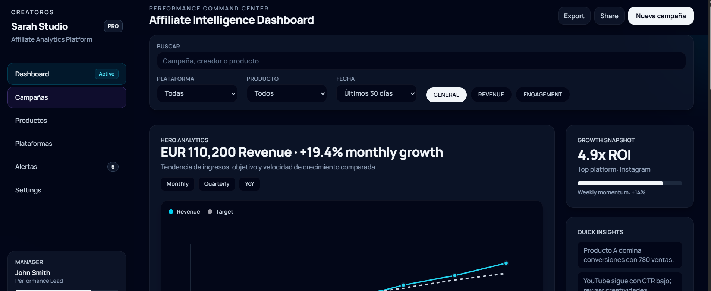
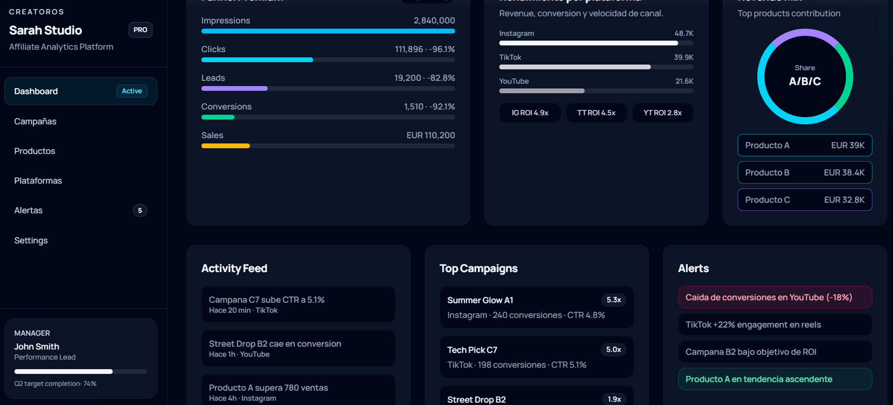

Eres un Desarrollador Frontend Senior especializado en HTML, Tailwind y JavaScript. Debes construir un Panel de Administración.

## Contexto del Proyecto
Panel de Administración para una plataforma SaaS llamada AgentHub en la cual las empresas pueden alquilar agentes de IA — asistentes inteligentes preconfigurados que pueden equiparse con distintas skills (habilidades como navegar por la web, leer documentos o gestionar calendarios) y desplegarse para tareas de negocio específicas. 
Los usuarios de este panel serán los empleados de AgentHub.
Project:
- Archivos:
  index.html
  gestion-de-usuarios.html
  gestion-de-agentes.html
  skills.html
  contrataciones-de-agentes.html
  log-de-errores.html
- HTML
- Tailwind via CDN v4.0 ()
- JavaScript Vanilla
- Paleta Modo Claro:
  Fondo Principal: #F8F9FA 
  Fondo de Tarjetas/Paneles: #FFFFFF 
  Color de Marca / Acción Principal: #0A2540 
  Texto Principal / Títulos: #1A1F26
  Texto Secundario / Bordes: #697386 
- Paleta Modo Oscuro:
  Fondo Principal: #0B0F17 
  Fondo de Tarjetas/Paneles: #161C2A 
  Color de Marca / Resaltados: #2463EB
  Texto Principal: #F3F4F6 
  Texto Secundario: #9CA3AF 
  Bordes y Líneas de División: #2D3748 

## Contexto de la tarea
- El panel debe incluir seis secciones (index.html(su contenido será el Dashboard), gestion-de-usuarios.html, gestion-de-agentes.html, skill.html, contrataciones-de-agentes.html y log-de-errores.html que deben ser accesibles desde un sidebar izquierdo con navegación lateral persistente y el contenido principal debe ser flexible. Un toggle en la barra superior debe permitir cambiar toda la interfaz entre modo claro y modo oscuro usando las utilidades dark: de Tailwind.
- El header debe ser reutilizable en cada archivo HTML contener un componente de barra superior de ancho completo que se adapta a los distintos tamaños de pantalla. Dentro de esta barra debe haber una caja a la derecha con el botón funcional de modo claro y modo oscuro, el nombre del usuario y un marcador de posición para la foto de perfil del usuario. 
- El sidebar debe  ser un componente reutilizable en cada archivo html. Debe tener un ancho fijo,los enlaces deben estar dentro de una etiqueta nav, dispuestos de forma vertical con relleno generoso y estado activo, sin hover. El sidebar debe colapsar en mobile en un navbar inferior con iconos que representan a los diferentes enlaces del menú con un hover sutil al pasar el cursor sobre ellos o al hacer clic.
- El footer debe ser un componente reutilizable en cada archivo HTML y debe contener una sola línea con Copyright e Identidad, un enlace de soporte, Políticas Legales y Créditos de Desarrollo.

- Diseño de index.html: 
Debe contener cuatro cards de graficos Dashboards (componente reutilizable) dispuestas en una grilla de 2X2 en escritorio  que colapsan a una sola pila en tablet y mobile. La cuatro cards son:

 ingresos totales generados (este mes)
 pérdida total por descuentos y cupones
número de agentes activos en todos los clientes 
número de agentes actualmente marcados como fallando. 

El componente card debe incluir header con el titulo de la card, un gráfico con colores representativos de altas y bajas y debajo ítems que indiquen qué representa cada parte del gráfico con su respectivo color. Las tarjetas usan colores de acento distintivos por métricas con una sombra sutil. Cada uno de estos debe ser una tarjeta de métrica visible y reutilizable.

 Debajo de las tarjetas, incluye un área de marcador de posición para un gráfico de actividad semanal.

- Diseño de gestion-de-usuarios.html:
Una tabla que lista todos los usuarios registrados (nombre, email, plan, estado). Cada fila debe tener un dropdown de acciones — un pequeño menú activado con un botón ⋮ — con al menos dos opciones: "Ver detalle" y "Eliminar". Al elegir "Ver detalle" se abre un modal overlay con el registro completo del usuario. El modal debe cerrarse mediante un botón y haciendo clic en el backdrop.
El modal overlay debe ser un componente reutilizable. Contiene un header con el titulo Información del Usuario y Subtitulos como:
 Información personal, con etiquetas p Nombre, Apellido, fecha de nacimiento, dirección, email, teléfono, ciudad, pais.
Información del plan, con etiquetas p Nombre del plan, fecha de contratación, fecha de vencimiento, método de pago, estado del plan (activo, inactivo).
El modal debe tener un borde sutil y relleno generoso.

- Diseño de gestion-de-agentes.html:
Un listado de todos los agentes registrados en la plataforma, mostrando nombre del agente, propietario, estado actual (activo / inactivo / fallando) y una lista de skills colapsada. 
Las skills asociadas a cada agente están ocultas por defecto; hacer clic en un control expandible las revela con una transición suave. 
Cada agente también tiene un dropdown de acciones con las opciones "Configurar" — que abre un modal con el prompt de sistema del agente — y "Eliminar".
Reutiliza el componente modal de la página gestión-de-usuarios.html y adapta su contenido al prompt del sistema de cada agente. 

- Diseño de skills.html:
Skills Una sección dedicada al catálogo de skills disponibles — las capacidades que se pueden adjuntar a los agentes. Cada skill tiene un nombre, una descripción breve, y un indicador de cuántos agentes la tienen habilitada actualmente. 
Incluye una breve explicación dentro del panel sobre qué significa una "skill" en el contexto de AgentHub. 
Las skills también tienen un dropdown de acciones con "Ver detalle" y "Eliminar".
Utiliza el componente modal reutilizable de las páginas anteriores y adapta su contenido a cada skill.

- Diseño de contrataciones-de-agentes.html:
Una tabla que muestra todos los contratos de alquiler activos y pasados.
 Cada fila debe mostrar el cliente, el agente alquilado, las skills contratadas, las fechas del contrato y el importe total pagado. 
Cada fila tiene un dropdown de acciones.
 Al elegir "Ver detalle" se abre un modal con el desglose completo del contrato, incluyendo la lista desglosada de skills contratadas y sus precios individuales.
Utiliza el componente modal reutilizable de las páginas anteriores y adapta su contenido a cada tipo de contrato.

- log-de-errores.html:
 Un registro de errores de ejecución de los agentes — mostrando timestamp, nombre del agente, tipo de error y una descripción breve. 
Los errores deben categorizarse visualmente por tipo o gravedad usando badges con código de color. 
Cada entrada tiene un dropdown de acciones con "Ver detalle" (abre un modal con la traza completa del error) y "Marcar como resuelto".
Utiliza el componente modal reutilizable de las páginas anteriores y adapta su contenido a cada tipo de error.

- Usa estas imágenes de referencia para el color y diseño de las cards, modales, gráficos, bordes, sombras, hover, estados activos, tipogafias y rellenos.

Componentes reutilizables:
-Barra superior
-Sidebar
-Footer
-Modal
-Card de métrica

## Contexto de la salida
Sitio web responsivo
Componentes reutilizables
Archivos HTML semánticos vinculados entre sí
Accesibilidad: Navegable por teclado y etiquetas ARIA
Tailwind CSS v4.0
JavaScript vanilla
Paleta de colores establecida en el contexto del projecto
Sin estilos en linea
Sin archivo CSS externo
Sin backend
Sin framework

## Contexto del Proyecto
Panel de Administración para una plataforma SaaS llamada AgentHub en la cual las empresas pueden alquilar agentes de IA — asistentes inteligentes preconfigurados que pueden equiparse con distintas skills (habilidades como navegar por la web, leer documentos o gestionar calendarios) y desplegarse para tareas de negocio específicas. 
Los usuarios de este panel serán los empleados de AgentHub.
Project:
- Archivos:
  index.html
  gestion-de-usuarios.html
  gestion-de-agentes.html
  skills.html
  contrataciones-de-agentes.html
  log-de-errores.html
- HTML
- Tailwind via CDN v4.0 ()
- JavaScript Vanilla
- Paleta Modo Claro:
  Fondo Principal: #F8F9FA 
  Fondo de Tarjetas/Paneles: #FFFFFF 
  Color de Marca / Acción Principal: #0A2540 
  Texto Principal / Títulos: #1A1F26
  Texto Secundario / Bordes: #697386 
- Paleta Modo Oscuro:
  Fondo Principal: #0B0F17 
  Fondo de Tarjetas/Paneles: #161C2A 
  Color de Marca / Resaltados: #2463EB
  Texto Principal: #F3F4F6 
  Texto Secundario: #9CA3AF 
  Bordes y Líneas de División: #2D3748 

## Contexto de la tarea
- El panel debe incluir seis secciones (index.html(su contenido será el Dashboard), gestion-de-usuarios.html, gestion-de-agentes.html, skill.html, contrataciones-de-agentes.html y log-de-errores.html que deben ser accesibles desde un sidebar izquierdo con navegación lateral persistente y el contenido principal debe ser flexible. Un toggle en la barra superior debe permitir cambiar toda la interfaz entre modo claro y modo oscuro usando las utilidades dark: de Tailwind.
- El header debe ser reutilizable en cada archivo HTML contener un componente de barra superior de ancho completo que se adapta a los distintos tamaños de pantalla. Dentro de esta barra debe haber una caja a la derecha con el botón funcional de modo claro y modo oscuro, el nombre del usuario y un marcador de posición para la foto de perfil del usuario. 
- El sidebar debe  ser un componente reutilizable en cada archivo html. Debe tener un ancho fijo,los enlaces deben estar dentro de una etiqueta nav, dispuestos de forma vertical con relleno generoso y estado activo, sin hover. El sidebar debe colapsar en mobile en un navbar inferior con iconos que representan a los diferentes enlaces del menú con un hover sutil al pasar el cursor sobre ellos o al hacer clic.
- El footer debe ser un componente reutilizable en cada archivo HTML y debe contener una sola línea con Copyright e Identidad, un enlace de soporte, Políticas Legales y Créditos de Desarrollo.

- Diseño de index.html: 
Debe contener cuatro cards de graficos Dashboards (componente reutilizable) dispuestas en una grilla de 2X2 en escritorio  que colapsan a una sola pila en tablet y mobile. La cuatro cards son:

 ingresos totales generados (este mes)
 pérdida total por descuentos y cupones
número de agentes activos en todos los clientes 
número de agentes actualmente marcados como fallando. 

El componente card debe incluir header con el titulo de la card, un gráfico con colores representativos de altas y bajas y debajo ítems que indiquen qué representa cada parte del gráfico con su respectivo color. Las tarjetas usan colores de acento distintivos por métricas con una sombra sutil. Cada uno de estos debe ser una tarjeta de métrica visible y reutilizable.

 Debajo de las tarjetas, incluye un área de marcador de posición para un gráfico de actividad semanal.

- Diseño de gestion-de-usuarios.html:
Una tabla que lista todos los usuarios registrados (nombre, email, plan, estado). Cada fila debe tener un dropdown de acciones — un pequeño menú activado con un botón ⋮ — con al menos dos opciones: "Ver detalle" y "Eliminar". Al elegir "Ver detalle" se abre un modal overlay con el registro completo del usuario. El modal debe cerrarse mediante un botón y haciendo clic en el backdrop.
El modal overlay debe ser un componente reutilizable. Contiene un header con el titulo Información del Usuario y Subtitulos como:
 Información personal, con etiquetas p Nombre, Apellido, fecha de nacimiento, dirección, email, teléfono, ciudad, pais.
Información del plan, con etiquetas p Nombre del plan, fecha de contratación, fecha de vencimiento, método de pago, estado del plan (activo, inactivo).
El modal debe tener un borde sutil y relleno generoso.

- Diseño de gestion-de-agentes.html:
Un listado de todos los agentes registrados en la plataforma, mostrando nombre del agente, propietario, estado actual (activo / inactivo / fallando) y una lista de skills colapsada. 
Las skills asociadas a cada agente están ocultas por defecto; hacer clic en un control expandible las revela con una transición suave. 
Cada agente también tiene un dropdown de acciones con las opciones "Configurar" — que abre un modal con el prompt de sistema del agente — y "Eliminar".
Reutiliza el componente modal de la página gestión-de-usuarios.html y adapta su contenido al prompt del sistema de cada agente. 

- Diseño de skills.html:
Skills Una sección dedicada al catálogo de skills disponibles — las capacidades que se pueden adjuntar a los agentes. Cada skill tiene un nombre, una descripción breve, y un indicador de cuántos agentes la tienen habilitada actualmente. 
Incluye una breve explicación dentro del panel sobre qué significa una "skill" en el contexto de AgentHub. 
Las skills también tienen un dropdown de acciones con "Ver detalle" y "Eliminar".
Utiliza el componente modal reutilizable de las páginas anteriores y adapta su contenido a cada skill.

- Diseño de contrataciones-de-agentes.html:
Una tabla que muestra todos los contratos de alquiler activos y pasados.
 Cada fila debe mostrar el cliente, el agente alquilado, las skills contratadas, las fechas del contrato y el importe total pagado. 
Cada fila tiene un dropdown de acciones.
 Al elegir "Ver detalle" se abre un modal con el desglose completo del contrato, incluyendo la lista desglosada de skills contratadas y sus precios individuales.
Utiliza el componente modal reutilizable de las páginas anteriores y adapta su contenido a cada tipo de contrato.

- log-de-errores.html:
 Un registro de errores de ejecución de los agentes — mostrando timestamp, nombre del agente, tipo de error y una descripción breve. 
Los errores deben categorizarse visualmente por tipo o gravedad usando badges con código de color. 
Cada entrada tiene un dropdown de acciones con "Ver detalle" (abre un modal con la traza completa del error) y "Marcar como resuelto".
Utiliza el componente modal reutilizable de las páginas anteriores y adapta su contenido a cada tipo de error.

Componentes reutilizables:
-Barra superior
-Sidebar
-Footer
-Modal
-Card de métrica

## Contexto de la salida
Componentes reutilizables
Archivos HTML semánticos vinculados entre sí
Accesibilidad: Navegable por teclado y etiquetas ARIA
Tailwind CSS v4.0
JavaScript vanilla
Paleta de colores establecida en el contexto del projecto
Sin estilos en linea
Sin archivo CSS externo
Sin backend
Sin framework
